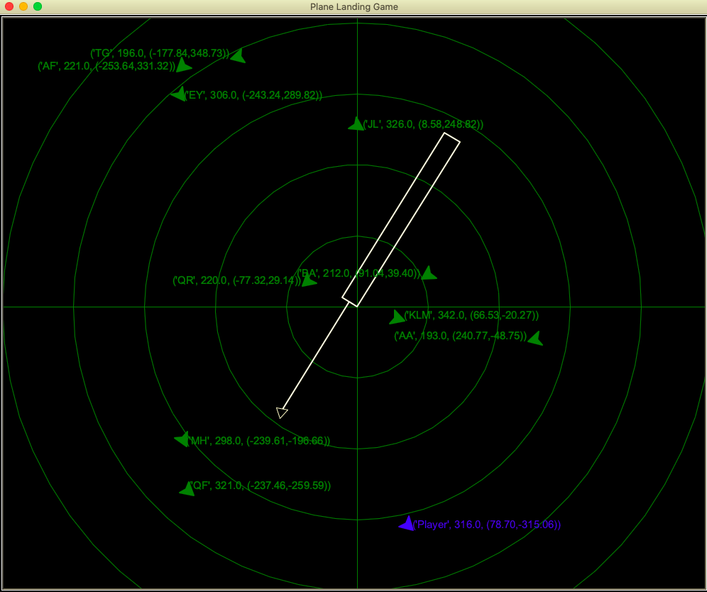
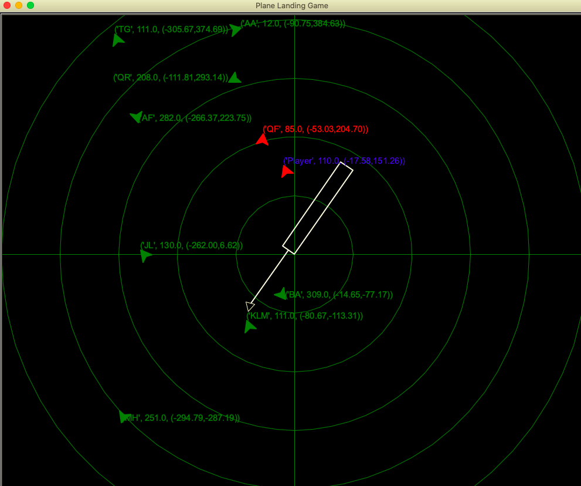

# Plane Landing Game
Welcome to Plane Landing Game by Zion Keretho using Python. Enjoy!

## Gameplay

In this game, players This is game about landing a plane which player needs to avoid crashing with other aircraft 
and make the plane landing safely to the runway and the plane will make landing automatically by capture the localizer symbol 
on the screen (triangle). 

The game will start by asking radar (Background color) and then asking runway color and lastly asking the radar sweep speed 1-3 
the faster will be harder. However, players plane will have Blackbox which will save data about player's plane 
At the end of the game, the game will ask the player that player want to investigate and see that blackbox data from database and show it on console.
### Game Control
Player can control a plane using arrow left and arrow right key (speed of every plane is constant).
There will be 10 planes on the screen which only go forward.

### Plane Crash (Game Over)
If player's plane goes near any bot plane it will warn the player by turning the player's plane and bot plane to red color 
and if both plane crash with each other the game is over.

# About the Project
This project made for 01219114/01219115 Programming 1 course, Software and Knowledge Engineering at Kasetsart University
In this project, consist of 5 module and 1 main program

## Main Program
* `game.py`

## Module
* `plane.py`
* `runway.py`
* `coordinate.py`
* `blackbox.py`
* `database.py`

## Main Program `game.py`
This program will be an entry point for this game you can run this program to start the game

## Module `plane.py`

This module contains the Plane class for creating plane each plane have these following attributes
* callsign 
* heading 
* pos 
* color

## Module `runway.py`

This module contains the Runway class for creating runway on the screen and one runway have these following attributes
* pos

* heading  
* width
* length
* color

## Module  `coordinate.py`
This module contains the Coordinate class used to be data type of position in other module and there is 2 attributs

* x
* y

## Module `blackbox.py`
This module contains the Blackbox class used to contains position, callsign, heading of each plane
There are 3 attributes in Blackbox class
* position
* callsign
* heading

## Module `database.py`
This module contains the FligthDB class used to for storing flight data of each plane in the radar
which have 1 attribute
* name

## Required Python Version and Libraries
These are required Python Version and Libraries for Plane Landing Game
* Python 3.8  
* turtle library with screen
* copy library
* time library

# Thank you For Playing :)